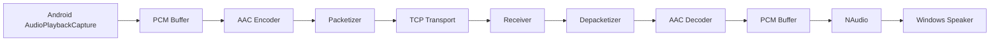
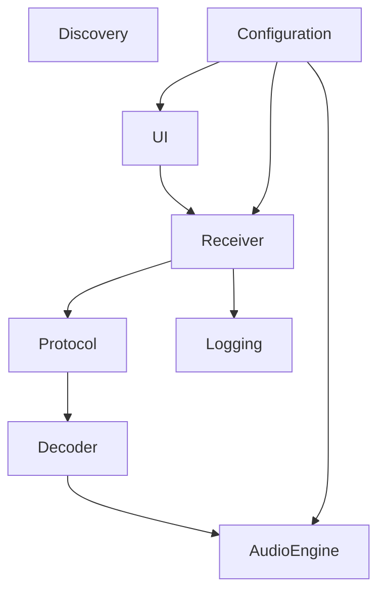

# OpenAudioLink

> An open, low-latency wireless audio transport solution for Android and Windows.

<p align="center">

Low Latency · Local Network · Windows 7+ · Android 10+ · Open Protocol

</p>

---

## Introduction

OpenAudioLink (OAL) is an open-source, low-latency wireless audio transport solution designed for Android and Windows.

Unlike traditional DLNA renderers, OpenAudioLink does **not** stream media files by requesting a remote URL.

Instead, it captures the **actual audio currently being played on an Android device** using the official Android AudioPlaybackCapture API, compresses it into a low-latency audio stream, and transmits it over the local network to a Windows receiver.

The Windows receiver then decodes the stream and outputs it to any local audio device using the Windows audio subsystem.

The overall user experience is intended to resemble Apple's AirPlay Audio, while remaining completely open, lightweight, and platform independent.

---

## Why OpenAudioLink?

Most existing wireless audio technologies were designed with very different goals.

### DLNA

DLNA is a media playback protocol.

A controller tells a renderer where a media file is located.

The renderer downloads the file itself.

Example:

```
Phone
   │
SetAVTransportURI
   │
   ▼
Windows

HTTP GET

music.mp3

↓

Decode

↓

Play
```

Advantages

- Standard protocol
- Widely supported
- Works well for media libraries

Disadvantages

- Not suitable for system audio
- Cannot stream arbitrary application audio
- Video synchronization is poor
- Phone is only a controller

---

### Bluetooth

Bluetooth transports already-decoded audio.

Example

```
Android

↓

PCM

↓

AAC / SBC / LDAC

↓

Bluetooth

↓

Windows
```

Advantages

- System-wide audio
- Excellent synchronization

Disadvantages

- Requires Bluetooth hardware
- Limited range
- Codec limitations
- Device pairing

---

### AirPlay Audio

AirPlay continuously transports audio frames over the network.

Advantages

- Low latency
- Excellent synchronization
- Entire device audio

Disadvantages

- Closed ecosystem
- No official Android implementation
- Proprietary protocol

---

## OpenAudioLink Approach

OpenAudioLink follows a completely different design philosophy.

Instead of implementing DLNA, AirPlay or Bluetooth protocols, OpenAudioLink defines a lightweight open protocol dedicated to wireless audio transport.

```
Android

↓

AudioPlaybackCapture

↓

AAC Encoder

↓

OpenAudioLink Protocol

↓

Windows Receiver

↓

AAC Decoder

↓

NAudio

↓

Speaker
```

The protocol is specifically optimized for:

- Low latency
- Stable transmission
- Minimal dependencies
- Easy implementation
- Future extensibility

---

# Project Goals

The primary goal of OpenAudioLink is extremely simple:

> Make any Windows computer behave like a wireless speaker for Android devices.

Users should be able to:

- Start the receiver
- Discover the PC automatically
- Select it from the Android application
- Continue playing music, videos or games
- Hear audio from the Windows speakers with minimal delay

No cloud service is required.

No account is required.

No Internet connection is required.

Only a local network.

---

# Design Principles

OpenAudioLink follows several important design principles.

## 1. Local Network First

All communication happens inside the local network.

Audio never leaves the LAN.

No external relay server exists.

No telemetry is required.

---

## 2. Low Latency

The project prioritizes latency over absolute audio fidelity.

Target latency:

| Version | Target |
|----------|---------|
| V1 | <150 ms |
| V2 | <50 ms |

---

## 3. Open Protocol

Every packet format is documented.

Every message is public.

No proprietary protocol.

Anyone can implement:

- Linux Receiver
- macOS Receiver
- ESP32 Receiver
- Raspberry Pi Receiver
- Embedded devices

using only the published protocol specification.

---

## 4. Windows 7 Compatibility

Windows 7 remains widely deployed in industrial environments.

OpenAudioLink intentionally targets:

- Windows 7 SP1
- Windows 8
- Windows 8.1
- Windows 10
- Windows 11

without requiring modern Windows APIs.

---

## 5. AI Friendly Development

Every module is designed to be independently understandable by AI coding assistants.

The repository contains detailed specifications, architecture documents and protocol descriptions allowing tools such as Codex, Claude Code and Gemini CLI to generate high-quality implementations.

---

# Features

Current planned features include:

- Android AudioPlaybackCapture
- Windows Audio Receiver
- AAC audio transport
- Automatic device discovery
- Background service
- System tray support
- Multiple audio output devices
- Automatic reconnection
- Volume synchronization
- Low CPU usage
- Low memory footprint
- Zero cloud dependency
- Open protocol
- Cross-platform protocol design

More features are planned for future releases.

---

# Project Status

| Component | Status |
|-----------|--------|
| Documentation | 🚧 In Progress |
| Protocol Design | 🚧 In Progress |
| Android Sender | ⏳ Planned |
| Windows Receiver | ⏳ Planned |
| Public Protocol Specification | ⏳ Planned |
| Linux Receiver | 🔮 Future |
| macOS Receiver | 🔮 Future |

---

# Documentation

Detailed documentation is available in the **docs/** directory.

| Document | Description |
|----------|-------------|
| docs/01-Introduction.md | Project background and design goals |
| docs/02-Architecture.md | Overall system architecture |
| docs/03-Protocol.md | OpenAudioLink protocol specification |
| docs/04-Android.md | Android implementation details |
| docs/05-Windows.md | Windows implementation details |
| docs/06-Audio.md | Audio pipeline |
| docs/07-Discovery.md | Device discovery |
| docs/08-Configuration.md | Configuration system |
| docs/09-Deployment.md | Deployment guide |
| docs/10-Testing.md | Testing strategy |
| docs/11-Roadmap.md | Future roadmap |

---

# System Architecture

OpenAudioLink is divided into two independent applications communicating through a lightweight private protocol.

```
                   ┌─────────────────────────────┐
                   │        Android Device       │
                   └─────────────────────────────┘
                                │
                                │
                     AudioPlaybackCapture API
                                │
                                ▼
                    Audio Capture Service
                                │
                                ▼
                     AAC Hardware Encoder
                                │
                                ▼
                    OpenAudioLink Protocol
                                │
                     TCP (V1) / UDP (V2)
                                │
────────────────────────────────┼────────────────────────────────
                                │
                                ▼
                   ┌─────────────────────────────┐
                   │      Windows Receiver        │
                   └─────────────────────────────┘
                                │
                                ▼
                     Packet Reassembly Layer
                                │
                                ▼
                        AAC Decoder
                                │
                                ▼
                         Audio Pipeline
                                │
                                ▼
                       NAudio Output Engine
                                │
                                ▼
                      Windows Audio Device
```

The Android application is responsible only for audio capture and transmission.

The Windows application is responsible only for receiving, decoding and playback.

Neither side knows implementation details of the other.

Communication is performed exclusively through the OpenAudioLink protocol.

---

# Design Philosophy

Unlike many desktop audio streaming solutions, OpenAudioLink intentionally keeps the protocol extremely small.

Instead of building a "remote desktop for audio", every component has only one responsibility.

| Module | Responsibility |
|---------|----------------|
| Android Capture | Capture system playback |
| Audio Encoder | Compress audio |
| Transport Layer | Reliable delivery |
| Receiver | Receive packets |
| Decoder | Restore PCM |
| Audio Engine | Play PCM |
| Discovery | Device discovery |
| Configuration | User settings |

Each module can be developed independently.

This greatly improves maintainability and AI-assisted development.

---

# Audio Pipeline

The complete audio pipeline is illustrated below.



Every stage is isolated.

Replacing any single component should not affect the remaining pipeline.

For example:

AAC Encoder

↓

can later become

↓

Opus Encoder

without modifying:

- Discovery
- Configuration
- UI
- Audio Output

---

# Why AAC in Version 1?

Several codecs were evaluated.

| Codec | Android Encoder | Windows Decoder | Latency | Complexity |
|--------|-----------------|-----------------|----------|------------|
| AAC | Native | Native | Good | Low |
| Opus | Third-party | Third-party | Excellent | Medium |
| FLAC | Native | Native | High | Medium |
| PCM | None | None | Excellent | Very High Bandwidth |

Although Opus offers lower latency, AAC is selected for Version 1 because:

- Android provides hardware encoding
- Windows Media Foundation provides hardware decoding
- No external codec library is required
- Easy deployment
- Excellent compatibility

The objective of Version 1 is simplicity.

Version 2 will introduce an alternative Opus transport.

---

# Why TCP?

The first implementation deliberately chooses TCP instead of UDP.

Reasons include:

- Easier implementation
- No packet loss handling
- No jitter buffer required
- No Forward Error Correction
- No retransmission logic
- Easy debugging
- Reliable delivery

Although TCP slightly increases latency, it significantly reduces implementation complexity.

This makes Version 1 suitable as the protocol reference implementation.

---

# Planned V2 Improvements

Version 2 upgrades the transport layer.

```
Version 1

AAC
↓

TCP
↓

Playback

====================

Version 2

Opus

↓

UDP

↓

Jitter Buffer

↓

FEC

↓

Playback
```

Expected improvements:

- Lower latency
- Better Wi-Fi performance
- Lower bandwidth
- Better packet loss resilience

---

# Module Architecture

The Windows application consists of several independent modules.



Every module exposes a clean interface.

No module accesses another module's internal implementation.

---

# Android Modules

```text
Android

├── app
│
├── capture
│
├── encoder
│
├── transport
│
├── discovery
│
├── protocol
│
├── configuration
│
└── logging
```

Responsibilities:

capture

Capture Android playback audio.

encoder

Compress PCM into AAC.

transport

Maintain TCP connection.

discovery

Locate receivers using mDNS.

protocol

Serialize and deserialize packets.

configuration

Persist application settings.

logging

Diagnostic logging.

---

# Windows Modules

```text
Windows

├── UI
│
├── Receiver
│
├── Decoder
│
├── Audio
│
├── Discovery
│
├── Protocol
│
├── Configuration
│
└── Logging
```

Responsibilities:

Receiver

Maintains client connections.

Protocol

Parses incoming packets.

Decoder

Converts AAC to PCM.

Audio

Outputs PCM using NAudio.

Configuration

Stores persistent settings.

Logging

Records runtime diagnostics.

UI

Displays current connection status and configuration.

---

# Repository Structure

The repository is intentionally organized to separate implementation from specifications.

```text
OpenAudioLink

├── README.md

├── docs/

├── specs/

├── Android/

├── Windows/

├── Shared/

├── Tools/

├── examples/

└── .codex/
```

The **docs/** directory explains the design.

The **specs/** directory defines the protocol.

The **examples/** directory contains standalone demonstrations.

The **Shared/** directory contains platform-independent definitions.

This separation allows every component to evolve independently.

# Repository Layout

The repository follows a specification-driven architecture.

Instead of mixing documentation and source code together, OpenAudioLink separates:

- Specifications
- Architecture
- Platform implementations
- Shared components
- Examples
- Development tools

This organization keeps the project scalable as additional platforms are added.

The repository layout is shown below.

```text
OpenAudioLink
│
├── README.md
├── LICENSE
├── CHANGELOG.md
├── CONTRIBUTING.md
├── SECURITY.md
├── .gitignore
│
├── docs/
│
├── specs/
│
├── Android/
│
├── Windows/
│
├── Shared/
│
├── examples/
│
├── Tools/
│
└── .codex/
```

Each directory has a single responsibility.

---

# Documentation Directory

```
docs/

01-Introduction.md

02-Architecture.md

03-Protocol.md

04-Android.md

05-Windows.md

06-Audio.md

07-Discovery.md

08-Configuration.md

09-Deployment.md

10-Testing.md

11-Roadmap.md

```

The **docs** directory contains documentation intended for humans.

Its purpose is to explain:

- Why the project exists
- How the architecture works
- Why design decisions were made

The documents are descriptive rather than normative.

---

# Specification Directory

```
specs/

packet-format.md

transport.md

audio-frame.md

message-types.md

connection-state.md

receiver-state.md

error-codes.md

timing.md

latency-budget.md

versioning.md
```

Unlike the documentation, the **specs** directory contains normative definitions.

Every specification answers the question:

> "Exactly how should this component behave?"

Specifications never contain implementation details.

Instead, they define:

- Binary packet formats
- Message sequences
- State transitions
- Timing constraints
- Error handling

The implementation must conform to the specifications.

---

# Android Project

The Android implementation is intentionally modular.

```
Android/

app/

capture/

encoder/

transport/

protocol/

discovery/

configuration/

logging/
```

Each module has only one responsibility.

For example:

capture/

Only interacts with the Android AudioPlaybackCapture API.

encoder/

Only converts PCM into AAC.

transport/

Only manages network communication.

This separation allows independent testing.

---

# Windows Solution

The Windows implementation follows the same philosophy.

```
Windows/

OpenAudioLink.sln

src/

UI/

Receiver/

Decoder/

Audio/

Protocol/

Discovery/

Configuration/

Logging/

tests/
```

The solution separates user interface from protocol logic.

No UI code should ever decode audio.

No audio engine should know how packets arrive.

Every layer communicates only through interfaces.

---

# Shared Library

Many definitions are platform independent.

Those are placed inside:

```
Shared/
```

Examples include:

```
Shared/

Packet Definitions

Protocol Constants

Message IDs

Configuration Models

Error Codes

Utilities
```

Whenever possible, platform-specific code should not duplicate these definitions.

This improves long-term maintainability.

---

# Examples

Every important subsystem should have a minimal runnable example.

```
examples/

hello-client

hello-server

mdns-discovery

aac-stream

audio-loopback

configuration

protocol-parser
```

Examples serve multiple purposes.

Developers can:

- Verify functionality
- Learn APIs
- Debug problems
- Experiment without affecting the main project

Examples should have minimal dependencies.

---

# Development Tools

```
Tools/

Packet Analyzer

Latency Tester

Traffic Generator

Configuration Generator

Audio Benchmark
```

These tools are not part of the final application.

Instead, they assist development and debugging.

For example:

Packet Analyzer

Displays decoded protocol packets.

Latency Tester

Measures end-to-end delay.

Traffic Generator

Produces artificial traffic without requiring Android.

---

# AI Development Support

OpenAudioLink is designed for AI-assisted development.

The repository therefore contains an additional directory.

```
.codex/
```

Unlike traditional documentation, files inside `.codex` describe the project from the perspective of an AI coding assistant.

Contents include:

```
.codex/

PROJECT.md

ARCHITECTURE.md

TASKS.md

CODING_RULES.md

STYLE_GUIDE.md

PROMPTS.md
```

These files answer questions such as:

- What is the current project status?
- Which module should be implemented next?
- What coding style should be followed?
- Which interfaces already exist?
- Which files must never be modified?

This dramatically improves consistency when generating code with AI.

---

# Specification Driven Development

OpenAudioLink intentionally adopts a Specification Driven Development workflow.

Instead of writing code first, every feature begins with a specification.

The development lifecycle is:

```
Requirement

↓

Specification

↓

Architecture

↓

Implementation

↓

Testing

↓

Release
```

This provides several advantages.

Developers always know:

- What must be implemented
- Why it exists
- How success is measured

AI coding assistants also benefit greatly because they receive explicit behavioral requirements rather than inferring intent from existing code.

---

# Coding Philosophy

Several rules are followed throughout the repository.

1.

Every class should have one responsibility.

2.

Every module should expose a clear interface.

3.

Business logic should never depend on UI.

4.

Protocol parsing should never directly access audio playback.

5.

Audio playback should never perform networking.

6.

Configuration should be centralized.

7.

Logging should never change application behavior.

8.

Every important subsystem should be independently testable.

Following these rules keeps the project understandable as it grows.

# Quick Start

## Requirements

### Android

| Item | Requirement |
|------|-------------|
| Android Version | Android 10 (API 29) or later |
| Permissions | Audio Playback Capture |
| Network | Wi-Fi / Ethernet LAN |
| Root | Not Required |

---

### Windows

| Item | Requirement |
|------|-------------|
| Operating System | Windows 7 SP1 or later |
| Runtime | .NET Framework 4.8 |
| Audio | Any Windows playback device |
| Network | Same LAN as Android |

---

## Installation

### Windows Receiver

Download the latest release.

Extract the package.

Run:

```
OpenAudioLink.exe
```

The receiver starts automatically.

By default it:

- Listens on the default TCP port
- Publishes itself through mDNS
- Waits for Android devices
- Minimizes to the system tray

No additional configuration is required.

---

### Android Sender

Install the APK.

Open the application.

Grant:

- Audio Capture permission

Select:

```
Receiver
```

Choose the discovered Windows computer.

Press:

```
Connect
```

All supported playback audio is now streamed to the receiver.

---

# Typical Workflow

```text
Start Windows Receiver

↓

Receiver announces itself

↓

Open Android Sender

↓

Receiver discovered

↓

Tap Connect

↓

Grant Audio Capture

↓

Audio starts streaming

↓

Playback begins on Windows
```

---

# Building From Source

## Windows

Requirements

- Visual Studio 2022
- .NET Framework 4.8 SDK
- Windows SDK

Open:

```
receiver-win/OpenAudioLink.sln
```

Build:

```
Release
```

Executable:

```
receiver-win/bin/Release/
```

---

## Android

Requirements

- Android Studio
- Android SDK 35
- Kotlin

Open:

```
sender-android/
```

Run:

```
Build APK
```

or

```
Build Bundle
```

---

# Development Workflow

The project follows an incremental development strategy.

```
Documentation

↓

Specification

↓

Protocol

↓

Receiver

↓

Sender

↓

Testing

↓

Optimization

↓

Release
```

Every new feature begins with documentation.

Implementation starts only after the specification is accepted.

---

# Development Roadmap

## Version 1.0

Core transport implementation.

Features:

- Android AudioPlaybackCapture
- AAC Encoder
- TCP Transport
- Windows Receiver
- Media Foundation Decoder
- NAudio Playback
- mDNS Discovery
- Configuration
- Logging

Target latency:

```
100–150 ms
```

---

## Version 1.1

Connection improvements.

Features:

- Automatic reconnect
- Receiver rename
- Output device selection
- Better diagnostics
- Persistent configuration

---

## Version 1.5

Performance improvements.

Features:

- Dynamic buffering
- Adaptive latency
- Packet statistics
- Audio diagnostics
- Latency visualization

---

## Version 2.0

Low latency transport.

Transport changes:

```
AAC

↓

Opus
```

```
TCP

↓

UDP
```

New modules:

- Jitter Buffer
- Packet Loss Recovery
- Forward Error Correction
- Adaptive Bitrate

Target latency:

```
20–50 ms
```

---

## Version 3.0

Multi-device ecosystem.

Possible features:

- Multi-room playback
- Receiver groups
- Broadcast mode
- Remote control API
- Audio synchronization
- Linux Receiver
- macOS Receiver
- Raspberry Pi Receiver

---

# Planned Features

## Audio

- AAC
- Opus
- Automatic bitrate
- Stereo
- Sample rate conversion
- Audio diagnostics

---

## Networking

- mDNS
- IPv4
- IPv6
- Auto reconnect
- Connection health monitoring

---

## Windows

- System tray
- Startup with Windows
- Multiple output devices
- Device hot-plug
- Volume synchronization

---

## Android

- Background service
- Automatic receiver discovery
- Connection history
- Battery optimization handling
- Foreground notification

---

# Contributing

Contributions are welcome.

Before opening a pull request:

1.

Read the documentation inside:

```
docs/
```

2.

Read the specifications inside:

```
specs/
```

3.

Follow the coding conventions described in:

```
.codex/CODING_RULES.md
```

4.

Ensure all examples continue to build.

5.

Ensure all tests pass.

---

# Reporting Issues

Bug reports should include:

- Operating system
- Android version
- Receiver version
- Sender version
- Log files
- Steps to reproduce

Feature requests should explain:

- Motivation
- Expected behavior
- Possible implementation

---

# License

OpenAudioLink is released under the MIT License.

See:

```
LICENSE
```

for complete details.

---

# Acknowledgements

OpenAudioLink is inspired by several outstanding open-source projects and technologies.

Special thanks to the communities behind:

- Android Open Source Project
- NAudio
- Media Foundation
- mDNS / Bonjour
- scrcpy
- FFmpeg
- Opus
- Wireshark

whose ideas, APIs, tools and documentation have greatly influenced the design of this project.

---

# Documentation Index

The following documents describe the project in detail.

| Document | Purpose |
|-----------|---------|
| docs/01-Introduction.md | Project background |
| docs/02-Architecture.md | Overall architecture |
| docs/03-Protocol.md | Wire protocol |
| docs/04-Android.md | Android implementation |
| docs/05-Windows.md | Windows implementation |
| docs/06-Audio.md | Audio pipeline |
| docs/07-Discovery.md | mDNS discovery |
| docs/08-Configuration.md | Configuration |
| docs/09-Deployment.md | Deployment |
| docs/10-Testing.md | Testing strategy |
| docs/11-Roadmap.md | Future roadmap |

---

## Project Vision

OpenAudioLink is more than a Windows application.

It is an open protocol and a reference implementation for low-latency wireless audio transport.

The long-term goal is to establish an open ecosystem where any device can send or receive audio using a lightweight, well-documented and royalty-free protocol.

Whether the receiver is running on Windows, Linux, macOS, Raspberry Pi or embedded hardware, interoperability should remain consistent through a common protocol specification.

The protocol—not the platform—is the center of the project.

