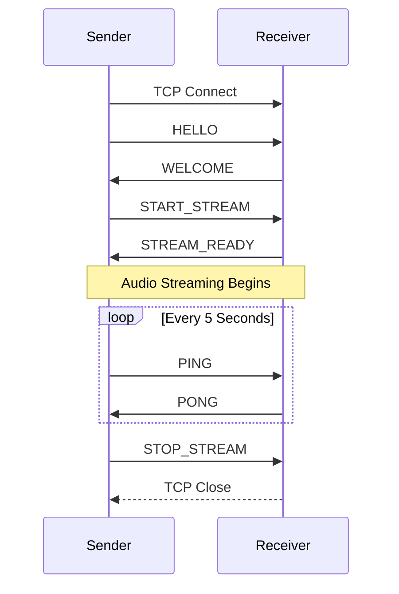
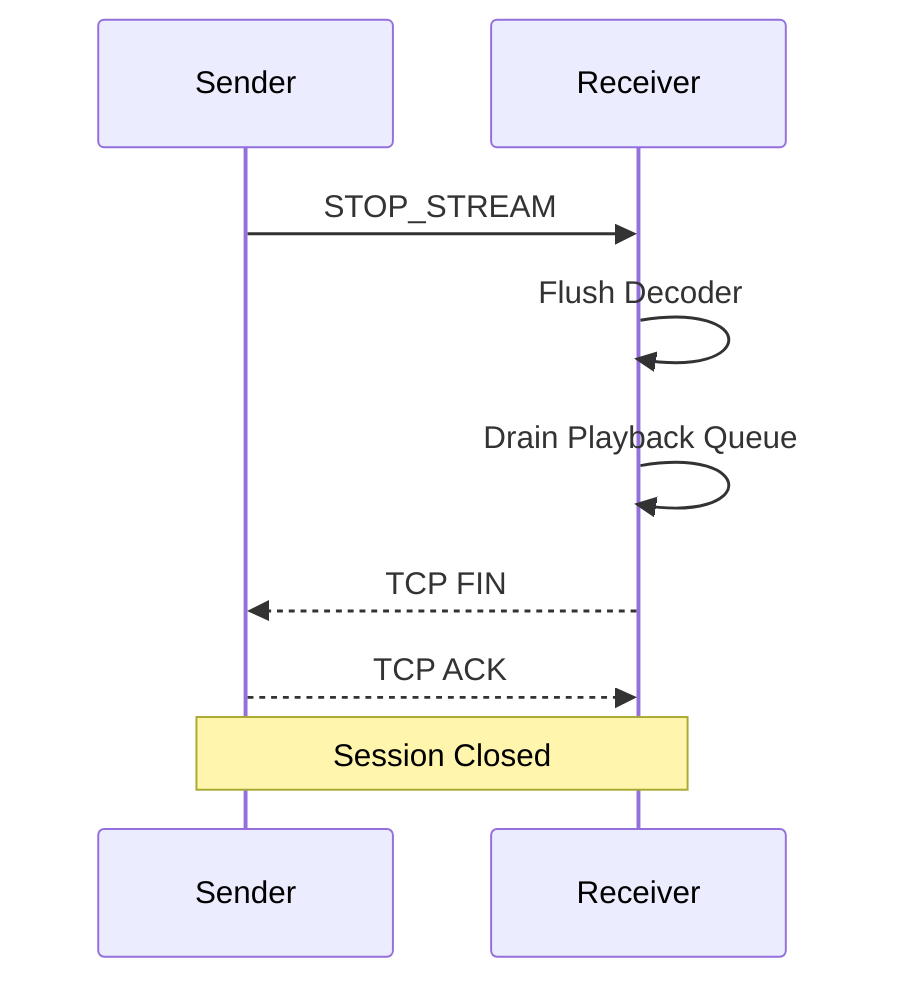
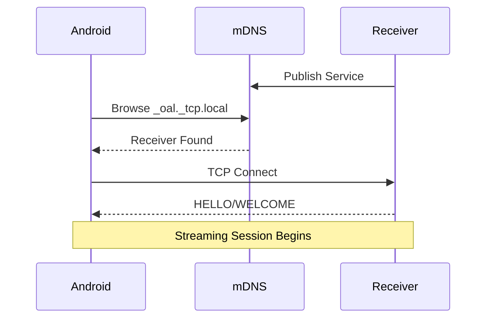

# docs/03-Protocol.md

# OpenAudioLink Protocol Specification

Version: 1.0 Draft

Status: Draft

---

# Purpose

This document defines the OpenAudioLink wire protocol.

Unlike implementation documents, this specification is normative.

Any implementation that follows this document should be wire-compatible with every other compliant implementation.

This document intentionally does not reference:

- Android APIs
- Windows APIs
- NAudio
- Media Foundation

It defines only:

- Binary packets
- Message formats
- Connection lifecycle
- Session state
- Timing requirements

---

# Design Goals

The protocol has the following objectives.

- Extremely simple
- Human readable specification
- Binary efficient
- Low latency
- Forward compatible
- Easy to implement
- Independent of programming language

The protocol is intentionally much smaller than DLNA, RAOP or RTP.

---

# Transport

Version 1 uses:

```
TCP
```

Only one TCP connection exists between sender and receiver.

Everything is multiplexed over this connection.

Including:

- Handshake
- Heartbeat
- Control
- Audio

Version 2 may introduce UDP for audio transport.

---

# Connection Model

Only one sender may connect to one receiver.

```
Sender

↓

TCP

↓

Receiver
```

The receiver rejects additional streaming sessions while one is active.

Future versions may allow:

- Multiple senders
- Broadcast mode
- Receiver groups

---

# Protocol Version

Every connection begins with version negotiation.

Current protocol:

```
Major = 1

Minor = 0
```

Compatibility rules:

Same Major

Compatible

Different Major

Incompatible

Minor version differences are handled through feature negotiation.

---

# Byte Order

All integer values use:

```
Big Endian
```

(Network Byte Order)

This guarantees identical behavior across platforms.

---

# Character Encoding

All text fields use:

```
UTF-8
```

Null termination is never used.

Every string is length-prefixed.

String layout:

| Offset | Size | Field |
| --- | --- | --- |
| 0 | 2 | Byte Length |
| 2 | N | UTF-8 Bytes |

- `Byte Length` is an unsigned 16-bit integer encoded in Big Endian.
- The length counts only the UTF-8 bytes and does not include the two-byte length field.
- Null termination is prohibited.
- Recommended maximum string length: 512 bytes.
- A receiver must reject strings whose declared length exceeds the remaining payload.

---

# Packet Structure

Every packet begins with the same fixed header.

```
+-------------------------------+

Magic

Version

PacketType

Flags

Sequence

Timestamp

PayloadLength

Payload

+-------------------------------+
```

This layout remains identical for every message.

Only the payload changes.

---

# Header Layout

```
Offset

Size

Field
```

```
0

4

Magic
```

```
4

1

Major Version
```

```
5

1

Minor Version
```

```
6

1

Packet Type
```

```
7

1

Flags
```

```
8

4

Sequence Number
```

```
12

8

Timestamp
```

```
20

4

Payload Length
```

```
24

N

Payload
```

Header Size

```
24 bytes
```

Fixed.

Never changes.

---

# Magic Number

The first four bytes identify OpenAudioLink traffic.

ASCII:

```
OALP
```

Hexadecimal:

```
4F 41 4C 50
```

Packets with an invalid magic number must be discarded immediately.

No additional parsing should occur.

---

# Version Fields

```
Major

1 byte
```

```
Minor

1 byte
```

Examples

```
1.0

01 00
```

```
1.1

01 01
```

```
2.0

02 00
```

---

# Packet Types

Every packet contains one packet type.

Current definitions:

| Value | Name |
|-------:|------|
| 0x01 | HELLO |
| 0x02 | WELCOME |
| 0x03 | START_STREAM |
| 0x04 | STREAM_READY |
| 0x05 | AUDIO |
| 0x06 | STOP_STREAM |
| 0x07 | PING |
| 0x08 | PONG |
| 0x09 | ERROR |
| 0x0A | CONFIG |
| 0x0B | STATUS |

Unknown packet types should be ignored whenever possible.

---

# Flags

Current flag definitions.

Bit 0

```
ACK Required
```

Bit 1

```
Compressed
```

Bit 2

```
Reserved
```

Bit 3

```
Reserved
```

Remaining bits are reserved.

Reserved bits must always be transmitted as zero.

Receivers must ignore unknown flag bits.

---

# Sequence Number

Every transmitted packet increments the sequence number.

```
0

↓

1

↓

2

↓

3

↓

...
```

Sequence numbers wrap naturally after:

```
0xFFFFFFFF
```

Version 1 uses sequence numbers for:

- Diagnostics
- Statistics
- Packet ordering

TCP guarantees delivery.

Therefore sequence numbers are not used for retransmission.

Version 2 will reuse them for UDP packet recovery.

---

# Timestamp

Timestamp represents the sender capture time.

Resolution:

```
Microseconds
```

Epoch:

```
Sender Boot Time
```

The timestamp is not synchronized with the receiver.

It is used for:

- Latency calculation
- Debugging
- Performance analysis

Playback scheduling is receiver-driven.

---

# Payload Length

Unsigned 32-bit integer.

Represents:

```
Payload Only
```

The header length is excluded.

Maximum payload:

```
4 GB
```

Practical payload size is much smaller.

Typical audio packet:

```
200–1200 bytes
```

Implementations should reject excessively large payloads before allocation.

---

# Packet Validation

Every received packet undergoes the following validation.

```
Magic

↓

Version

↓

Length

↓

Packet Type

↓

Payload

↓

Dispatch
```

If any validation fails:

Packet discarded.

Connection remains alive unless the failure indicates protocol incompatibility.

Malformed packets must never crash the receiver.

---

# Maximum Packet Size

To prevent memory exhaustion:

Recommended maximum:

```
64 KB
```

Any packet larger than this limit should be rejected.

Future protocol versions may negotiate larger frame sizes if necessary.

---

# Session Establishment

A streaming session begins immediately after the TCP connection has been established.

The sender is responsible for initiating the handshake.

The receiver must remain passive until the first protocol packet is received.

---

# Handshake Overview

The complete handshake is shown below.



No audio packets may be transmitted before STREAM_READY has been received.

---

# Session States

Sender state machine:

```
Idle

↓

Connecting

↓

Handshake

↓

Ready

↓

Streaming

↓

Stopping

↓

Disconnected
```

Receiver state machine:

```
Listening

↓

Connected

↓

Handshake

↓

Ready

↓

Streaming

↓

Disconnected

↓

Listening
```

Every implementation must follow these state transitions.

Undefined transitions are prohibited.

---

# HELLO Packet

Purpose:

Identify the sender and negotiate protocol compatibility.

Payload:

| Field | Type |
|--------|------|
| Sender Name | UTF-8 String |
| Sender Version | UTF-8 String |
| Protocol Major | UInt8 |
| Protocol Minor | UInt8 |
| Platform | UInt8 |
| Capabilities | UInt32 |

Example:

```
Sender Name

Android Phone
```

```
Version

1.0.0
```

```
Protocol

1.0
```

Platform values:

| Value | Platform |
|-------:|----------|
| 1 | Android |
| 2 | Windows |
| 3 | Linux |
| 4 | macOS |

Capabilities are represented as a bit mask.

---

# WELCOME Packet

Purpose:

Accept or reject the connection.

Payload:

| Field | Type |
|--------|------|
| Result | UInt8 |
| Receiver Name | UTF-8 String |
| Receiver Version | UTF-8 String |
| Session ID | UInt64 |

Result values:

| Value | Meaning |
|-------:|---------|
| 0 | Success |
| 1 | Unsupported Protocol |
| 2 | Receiver Busy |
| 3 | Authentication Required |
| 4 | Internal Error |

If Result is not Success, the sender should close the TCP connection.

---

# Session Identifier

Each accepted connection receives a unique Session ID.

Properties:

- Generated by receiver
- 64-bit unsigned integer
- Unique until receiver restart

The Session ID is included in log messages to simplify debugging.

---

# START_STREAM Packet

Purpose:

Request permission to begin audio transmission.

Payload:

| Field | Type |
|--------|------|
| Codec | UInt8 |
| Sample Rate | UInt32 |
| Channels | UInt8 |
| Bitrate | UInt32 |
| Frame Duration | UInt16 |

Example:

```
Codec

AAC
```

```
Sample Rate

48000
```

```
Channels

2
```

```
Bitrate

192000
```

```
Frame Duration

20 ms
```

The receiver validates the requested parameters before accepting the stream.

---

# STREAM_READY Packet

Purpose:

Confirm that the receiver is prepared to accept audio packets.

Payload:

| Field | Type |
|--------|------|
| Result | UInt8 |
| Negotiated Codec | UInt8 |
| Negotiated Sample Rate | UInt32 |
| Negotiated Channels | UInt8 |

If Result indicates success, audio transmission may begin immediately.

Result values:

| Value | Meaning |
|------:|---------|
| 0 | Success |
| 1 | Unsupported Codec |
| 2 | Unsupported Format |
| 3 | Receiver Not Ready |
| 4 | Internal Error |

---

# Codec Enumeration

Current codec identifiers:

| Value | Codec |
|-------:|------|
| 1 | AAC-LC |
| 2 | Opus |
| 3 | PCM |
| 4 | FLAC |

Version 1 requires support for AAC-LC.

Support for additional codecs is optional.

---

# Capability Flags

Capability flags allow protocol extensions without breaking compatibility.

Current assignments:

| Bit | Meaning |
|----:|---------|
| 0 | AAC Supported |
| 1 | Opus Supported |
| 2 | Configuration Exchange |
| 3 | Device Rename |
| 4 | Latency Reporting |
| 5-31 | Reserved |

Receivers ignore unknown capability bits.

---

# Protocol Negotiation

Negotiation follows these rules.

Major version differs:

```
Reject Connection
```

Major version matches:

```
Continue
```

Unsupported optional capability:

```
Ignore
```

Unknown mandatory feature:

```
Reject
```

This strategy allows future protocol evolution while maintaining backward compatibility.

---

# Receiver Busy

Only one active streaming session is allowed.

If another sender attempts to connect:

```
HELLO

↓

WELCOME(Result = Receiver Busy)

↓

TCP Close
```

The existing session is never interrupted automatically.

---

# Timeouts

The following timeout values are recommended.

| Event | Timeout |
|--------|---------|
| HELLO Wait | 5 seconds |
| WELCOME Wait | 5 seconds |
| STREAM_READY Wait | 5 seconds |
| PONG Wait | 15 seconds |
| TCP Connect | 10 seconds |

Timeout values should be configurable.

---

# Connection Failure

Handshake failure sequence:

```
TCP Connected

↓

HELLO Sent

↓

Timeout

↓

Retry

↓

Retry

↓

Retry

↓

Disconnect
```

Default retry count:

```
3
```

The sender should notify the user only after all retry attempts have failed.

---

# Graceful Disconnect

Normal shutdown sequence:



A graceful disconnect prevents playback artifacts and allows buffered audio to finish playing.

---

# Audio Transport

After a session has entered the Streaming state, the sender begins transmitting AUDIO packets.

AUDIO packets carry encoded audio frames only.

No control information should be embedded inside an audio frame.

Control traffic and media traffic remain logically independent.

---

# Audio Packet

Packet Type

```
0x05
```

Payload Structure

```
Codec

Frame Number

Frame Timestamp

Frame Duration

Frame Size

Encoded Audio

```

---

# Audio Payload Layout

| Offset | Size | Field |
|--------:|-----:|------|
| 0 | 1 | Codec |
| 1 | 4 | Frame Number |
| 5 | 8 | Capture Timestamp |
| 13 | 2 | Frame Duration (ms) |
| 15 | 4 | Encoded Size |
| 19 | N | Encoded Data |

The payload is appended directly after the common protocol header.

---

# Codec

Codec identifies the encoding method used by the payload.

Values:

| Value | Codec |
|-------:|------|
| 1 | AAC-LC |
| 2 | Opus |
| 3 | PCM |
| 4 | FLAC |

Version 1 requires AAC-LC.

---

# Frame Number

Frame Number increases by one for every encoded frame.

```
0

↓

1

↓

2

↓

3

↓

...
```

Unlike the protocol Sequence Number, Frame Number identifies logical audio frames.

Future versions using UDP will use Frame Number for packet loss detection.

---

# Capture Timestamp

Represents the moment when PCM samples were captured.

Resolution

```
Microseconds
```

Reference

```
Sender Monotonic Clock
```

The timestamp is unaffected by changes to the system clock.

---

# Frame Duration

Indicates the playback duration represented by this frame.

Typical values:

| Codec | Duration |
|--------|---------:|
| AAC | 20 ms |
| Opus | 20 ms |
| PCM | Variable |

Future protocol versions may negotiate different frame durations.

---

# Encoded Size

Length of Encoded Data only.

Does not include:

- Protocol Header
- Audio Payload Header

Receivers should verify that `Payload Length == 19 + Encoded Size` before decoding.

---

# Audio Decoder Pipeline

```text
Receive Packet

↓

Validate Header

↓

Parse Payload

↓

Decode Frame

↓

PCM Buffer

↓

Playback Queue

↓

Audio Device
```

Every stage must succeed before continuing.

Decoder failures affect only the current frame.

---

# Decoder Errors

Examples:

Unsupported Codec

↓

Drop Frame

↓

Continue

Invalid Frame Size

↓

Drop Frame

↓

Continue

Corrupted AAC Frame

↓

Drop Frame

↓

Continue

Decoder failures must never terminate the streaming session unless a configurable error threshold is exceeded.

---

# Playback Queue

Decoded PCM is inserted into a playback queue.

```
Network

↓

Decoder

↓

PCM Queue

↓

Audio Device
```

Version 1 uses FIFO ordering.

No frame reordering is required because TCP preserves packet order.

---

# Queue Capacity

Recommended default:

```
100 milliseconds
```

Receiver implementations should allow configuration within reasonable limits.

Suggested range:

```
40 ms

↓

250 ms
```

Lower values reduce latency.

Higher values improve resilience against temporary delays.

---

# Queue Overflow

Overflow occurs when decoded audio arrives faster than playback.

Handling:

```
PCM Queue Full

↓

Discard Oldest Frame

↓

Insert New Frame

↓

Continue
```

Dropping the oldest frame minimizes additional latency.

---

# Queue Underflow

Underflow occurs when playback consumes data faster than decoding produces it.

Handling:

```
Queue Empty

↓

Generate Silence

↓

Continue Playback
```

Playback timing must remain continuous.

Stopping and restarting the output device is discouraged because it introduces audible glitches.

---

# Audio Format

The decoded PCM format is fixed in Version 1.

| Property | Value |
|----------|------|
| Channels | 2 |
| Sample Rate | 48000 Hz |
| Sample Format | Signed PCM |
| Bit Depth | 16-bit |
| Endianness | Little Endian |

All supported codecs must decode into this canonical format before reaching the Audio Output layer.

---

# Silence Frames

The sender may optionally transmit Silence Frames.

Purpose:

- Maintain pipeline synchronization
- Keep decoder active
- Avoid output device starvation

Silence Frames use the normal AUDIO packet format.

Encoded audio contains silence only.

No special packet type is required.

---

# Packet Validation

Before decoding, every AUDIO packet is validated.

Validation order:

```text
Magic

↓

Version

↓

Packet Type

↓

Payload Length

↓

Codec

↓

Frame Size

↓

Decode
```

Failure at any stage causes the frame to be discarded.

---

# Statistics

The receiver maintains runtime statistics.

Recommended metrics:

| Metric | Description |
|--------|-------------|
| Frames Received | Total AUDIO packets |
| Frames Decoded | Successfully decoded |
| Frames Dropped | Invalid or discarded |
| Decoder Errors | Decoder failures |
| Queue Underflow | Playback starvation |
| Queue Overflow | Buffer overflow |

Statistics should be reset when a new streaming session begins.

---

# Latency Measurement

Estimated latency is calculated as:

```text
Receiver Time

-

Capture Timestamp

=

Transport Latency
```

Additional buffering latency may be reported separately.

Example:

```
Capture

12 ms

Network

18 ms

Decode

6 ms

Playback Queue

55 ms

-----------------

Total

91 ms
```

Latency reporting is intended for diagnostics only.

Playback scheduling remains receiver-driven.

---

# Frame Ordering

TCP guarantees packet order.

Therefore:

Expected order

```
Frame 100

↓

Frame 101

↓

Frame 102
```

Unexpected order

```
Frame 100

↓

Frame 102

↓

Frame 101
```

should never occur during normal operation.

If detected, the receiver should log a protocol warning.

No reordering algorithm is required in Version 1.

---

# Audio Stream Termination

Streaming ends after a STOP_STREAM packet.

Receiver behavior:

```text
Receive STOP_STREAM

↓

Stop Accepting AUDIO Packets

↓

Flush Decoder

↓

Drain Playback Queue

↓

Stop Playback

↓

Return Ready State
```

Remaining buffered audio should be played before the output device is stopped.

Abrupt termination should be avoided whenever possible.

---

# Control Messages

Control messages coordinate the lifetime of a streaming session.

Unlike AUDIO packets, control messages are infrequent and must always be processed before media data.

---

# PING

Packet Type

```
0x07
```

Purpose

Verify that the connection is still alive.

Payload

| Field | Type |
|--------|------|
| Sequence | UInt32 |
| Timestamp | UInt64 |

PING packets are generated by the sender.

Recommended interval:

```
5 seconds
```

---

# PONG

Packet Type

```
0x08
```

Purpose

Reply to a PING packet.

Payload

Exactly identical to the received PING.

The receiver should transmit PONG immediately.

Processing delay should normally remain below:

```
5 ms
```

---

# Heartbeat Timeline

```text
Sender

PING

────────────►

Receiver

PONG

◄────────────

5 Seconds

PING

────────────►

PONG

◄────────────
```

If several heartbeat intervals pass without receiving a response, the sender should assume that the connection has failed.

---

# Heartbeat Failure

Recommended behavior

```
PONG Timeout

↓

Retry Once

↓

Retry Twice

↓

Retry Third Time

↓

Disconnect

↓

Reconnect
```

Default heartbeat timeout:

```
15 seconds
```

---

# STOP_STREAM

Packet Type

```
0x06
```

Purpose

Gracefully terminate streaming.

Payload

None.

Upon receiving STOP_STREAM:

Receiver:

- Stops accepting AUDIO packets.
- Flushes the decoder.
- Plays all remaining buffered PCM.
- Releases session resources.

---

# ERROR

Packet Type

```
0x09
```

Purpose

Notify the peer that a protocol or runtime error occurred.

Payload

| Field | Type |
|--------|------|
| Error Code | UInt16 |
| Severity | UInt8 |
| Description | UTF-8 String |

The Description field is intended for diagnostics only.

Implementations must not rely on its content.

---

# Error Severity

| Value | Meaning |
|-------:|---------|
| 0 | Information |
| 1 | Warning |
| 2 | Recoverable Error |
| 3 | Fatal Error |

Fatal errors require the session to be terminated.

---

# Error Codes

Recommended assignments.

| Code | Meaning |
|------:|---------|
| 1000 | Unknown Error |
| 1001 | Invalid Packet |
| 1002 | Unsupported Protocol |
| 1003 | Unsupported Codec |
| 1004 | Invalid Payload |
| 1005 | Receiver Busy |
| 1006 | Decoder Failure |
| 1007 | Audio Device Failure |
| 1008 | Timeout |
| 1009 | Internal Exception |
| 1010 | Permission Denied |

Additional codes may be introduced without affecting existing implementations.

---

# CONFIG

Packet Type

```
0x0A
```

Purpose

Exchange runtime configuration.

Version 1 defines CONFIG as optional.

Payload

```
TLV Records
```

Each configuration item is encoded using:

```
Type

Length

Value
```

Unknown configuration records must be ignored.

---

# STATUS

Packet Type

```
0x0B
```

Purpose

Report runtime status.

STATUS packets are optional.

Suggested fields:

| Field | Type |
|--------|------|
| Current Latency | UInt32 |
| Queue Depth | UInt16 |
| Decoder Errors | UInt32 |
| Frames Received | UInt64 |
| Frames Dropped | UInt64 |

STATUS messages may be requested manually or transmitted periodically.

---

# TLV Encoding

Configuration records use a standard TLV format.

```
+-------------------------------+

Type

Length

Value

+-------------------------------+
```

Type

```
UInt16
```

Length

```
UInt16
```

Value

```
Variable
```

This format allows forward-compatible protocol extensions.

---

# Reserved Packet Types

Values reserved for future protocol revisions.

| Range | Purpose |
|--------|---------|
| 0x20–0x3F | Future Control Messages |
| 0x40–0x5F | Receiver Extensions |
| 0x60–0x7F | Sender Extensions |
| 0x80–0xFF | Experimental |

Implementations should ignore unknown packet types unless explicitly marked as mandatory.

---

# Receiver State Machine

```text
Listening

↓

Connected

↓

Handshake

↓

Ready

↓

Streaming

↓

Stopping

↓

Listening
```

The receiver should never transition directly from Streaming to Handshake.

A new TCP connection is required.

---

# Sender State Machine

```text
Idle

↓

Connecting

↓

Handshake

↓

Ready

↓

Streaming

↓

Stopping

↓

Disconnected

↓

Idle
```

State transitions should always be explicit.

Implicit transitions are prohibited.

---

# Protocol Recovery

Recoverable protocol violations.

Examples:

- Unknown optional packet
- Unsupported capability
- Unknown TLV record

Behavior

```
Ignore

↓

Continue
```

Fatal protocol violations.

Examples:

- Invalid protocol version
- Corrupted header
- Impossible packet length
- Malformed mandatory packet

Behavior

```
ERROR

↓

Disconnect
```

---

# Compatibility Rules

Receivers should follow these principles.

Unknown packet:

```
Ignore
```

Unknown TLV:

```
Ignore
```

Unknown capability:

```
Ignore
```

Unknown mandatory protocol version:

```
Reject
```

This strategy maximizes interoperability between protocol revisions.

---

# Logging Requirements

Recommended events.

Connection:

- Connected
- Disconnected
- Handshake Completed

Streaming:

- Stream Started
- Stream Stopped
- Decoder Error
- Queue Overflow
- Queue Underflow

Protocol:

- Invalid Packet
- Unknown Packet Type
- Version Mismatch

Logs should include:

- Session Identifier
- Timestamp
- Event Category
- Severity

Sensitive information should never be written to logs.

---

# Protocol Extensibility

The protocol is intentionally designed to evolve without breaking compatibility.

Future features may include:

- UDP transport
- Opus codec
- Receiver authentication
- TLS encryption
- Device groups
- Multi-room playback
- Receiver capability discovery
- Remote control commands
- Volume synchronization
- Metadata transport

Each extension should be introduced as a new optional capability whenever possible.

Major protocol revisions should be avoided unless wire compatibility cannot be preserved.

---

# Discovery Protocol

The OpenAudioLink discovery mechanism is intentionally independent from the streaming protocol.

Discovery is responsible only for locating available receivers.

Streaming always occurs over a separate TCP connection.

---

# Discovery Technology

Version 1 uses:

```
mDNS
```

with:

```
DNS-SD
```

This allows Android devices to automatically discover receivers without requiring manual IP address entry.

Future versions may additionally support:

- SSDP
- Static IP
- QR Code Pairing
- Bluetooth-assisted discovery

---

# Service Type

The receiver advertises the following service.

```
_oal._tcp.local
```

Service names should follow the format:

```
OpenAudioLink
```

or

```
Computer Name
```

Examples:

```
Office-PC

LivingRoom

Laptop
```

---

# TXT Records

The receiver publishes additional metadata using DNS-SD TXT records.

Recommended records:

| Key | Example |
|-----|---------|
| version | 1.0 |
| protocol | 1.0 |
| platform | Windows |
| codec | AAC |
| channels | 2 |
| samplerate | 48000 |
| name | Office-PC |

Unknown TXT keys must be ignored.

---

# Discovery Workflow



Discovery is complete before the protocol handshake begins.

---

# Receiver Advertisement

A receiver should begin advertising only after:

- Audio engine initialized
- TCP listener active
- Configuration loaded

If the receiver cannot accept connections, the service should not be advertised.

---

# Receiver Removal

A receiver should withdraw its advertisement when:

- Application exits
- Listening socket closes
- Fatal initialization error occurs

This prevents stale entries from remaining visible to senders.

---

# Connection Ownership

Discovery never reserves a receiver.

Example:

```
Receiver Advertised

↓

Android A Discovers

↓

Android B Discovers

↓

Android A Connects

↓

Receiver Busy

↓

Android B Receives Busy Response
```

Discovery does not indicate availability.

Availability is determined during protocol negotiation.

---

# Security Model

Version 1 assumes a trusted local network.

Discovery packets contain only public information.

Examples:

- Receiver name
- Supported protocol
- Codec
- Platform

Sensitive information must never be published through DNS-SD.

Examples:

- Username
- File paths
- MAC address
- Serial number
- IP history

---

# Receiver Identity

Each receiver owns a persistent identifier.

Recommended format:

```
UUID Version 4
```

Example:

```
3f91dbe6-7e45-4ef3-b6b5-18d74d0c5e91
```

The identifier remains unchanged until the application configuration is reset.

Friendly names may change.

Identifiers must remain stable.

---

# Capability Discovery

Discovery exposes only coarse capabilities.

Examples:

- Protocol Version
- Codec Support
- Platform
- Receiver Name

Detailed capability negotiation occurs only after TCP connection establishment.

---

# Protocol Compliance

Every compliant implementation must satisfy the following rules.

Sender:

- Validate protocol version.
- Validate packet length.
- Ignore unknown optional fields.
- Never transmit malformed packets.

Receiver:

- Validate every packet.
- Never trust payload lengths.
- Reject unsupported major versions.
- Remain operational after recoverable errors.

---

# Timing Requirements

Recommended timing constraints.

| Operation | Target |
|-----------|-------:|
| TCP Connect | < 2 s |
| HELLO Processing | < 50 ms |
| WELCOME Response | < 50 ms |
| STREAM_READY Response | < 50 ms |
| Decoder Startup | < 20 ms |
| Playback Start | < 100 ms |

These targets assume a healthy local network.

---

# Concurrency

Version 1 supports:

```
One Sender

↓

One Receiver

↓

One Audio Stream
```

No packet multiplexing is required.

Future protocol versions may support:

- Multiple sessions
- Broadcast streams
- Receiver groups

---

# Protocol Invariants

The following conditions must always remain true.

1.

Exactly one TCP connection exists per streaming session.

---

2.

Exactly one active audio stream exists per session.

---

3.

Protocol packets are processed in transmission order.

---

4.

Control packets are never embedded inside AUDIO packets.

---

5.

Every packet begins with the standard protocol header.

---

6.

Unknown optional protocol extensions never terminate a session.

---

7.

Fatal protocol violations always terminate the session.

---

8.

Protocol state transitions are deterministic.

---

# Recommended Limits

Receivers should enforce the following limits.

| Item | Recommended Limit |
|------|------------------:|
| Maximum Packet | 64 KB |
| Maximum Receiver Name | 64 bytes |
| Maximum Sender Name | 64 bytes |
| Maximum Description | 256 bytes |
| Maximum TXT Record | 512 bytes |
| Maximum Queue Depth | 250 ms |
| Maximum Decoder Startup | 2 s |

Implementations may choose stricter limits.

---

# Protocol Test Cases

The following interoperability tests are recommended.

Handshake

- Valid HELLO
- Invalid Version
- Receiver Busy
- Unknown Capability

Streaming

- Continuous Audio
- Decoder Restart
- Queue Overflow
- Queue Underflow

Network

- Temporary Disconnect
- Delayed PONG
- TCP Reset

Discovery

- Receiver Appears
- Receiver Disappears
- Multiple Receivers

Protocol

- Invalid Packet Type
- Invalid Length
- Invalid Magic
- Corrupted Payload

A compliant implementation should pass all applicable tests.

---

# Wire Compatibility

Two independent implementations are considered wire-compatible when:

- They successfully complete protocol negotiation.
- They exchange valid AUDIO packets.
- Audio is decoded correctly.
- Session termination is graceful.
- Unknown optional extensions are ignored correctly.

Wire compatibility is the primary objective of this specification.

Implementations are free to differ internally as long as externally observable behavior remains consistent.

---

# Reference Implementation Guidelines

This section is informative.

It describes the recommended implementation strategy for protocol developers.

Implementations may differ internally while remaining fully wire-compatible.

---

# Receiver Processing Pipeline

Every incoming packet should pass through the following pipeline.

```text
TCP Socket

↓

Receive Buffer

↓

Header Parser

↓

Header Validation

↓

Payload Validation

↓

Packet Dispatcher

↓

Message Handler

↓

Application
```

Validation must always occur before dispatch.

Packet handlers must never receive malformed packets.

---

# Sender Processing Pipeline

Outgoing packets should follow the opposite direction.

```text
Application

↓

Message Builder

↓

Payload Serializer

↓

Header Builder

↓

Transmit Queue

↓

TCP Socket
```

Packet construction should be immutable whenever practical.

Once a packet enters the transmit queue, it should never be modified.

---

# Receiver Packet Dispatcher

A recommended dispatcher implementation.

```text
HELLO

↓

HandleHello()

WELCOME

↓

HandleWelcome()

START_STREAM

↓

HandleStartStream()

AUDIO

↓

HandleAudio()

PING

↓

HandlePing()

STOP_STREAM

↓

HandleStopStream()

ERROR

↓

HandleError()
```

Each handler should process exactly one packet type.

---

# Thread Safety

Protocol state must remain thread-safe.

Recommended ownership model.

```text
Network Thread

↓

Protocol Thread

↓

Decoder Thread

↓

Playback Thread
```

Only one thread owns protocol state.

Other threads communicate through queues.

Avoid shared mutable objects whenever possible.

---

# Recommended Queue Sizes

Suggested defaults.

| Queue | Capacity |
|--------|---------:|
| Receive Queue | 128 Packets |
| Decode Queue | 64 Frames |
| Playback Queue | 100 ms PCM |
| Log Queue | 1024 Entries |

Queues should expose runtime statistics.

---

# Recommended Configuration Keys

The following configuration keys are recommended.

| Key | Default |
|-----|---------|
| receiver.name | Computer Name |
| receiver.port | 39888 |
| receiver.discovery | true |
| receiver.autoStart | true |
| receiver.minimizeToTray | true |
| audio.device | default |
| audio.bufferMs | 100 |
| audio.volumeSync | false |
| protocol.timeout | 5000 |
| logging.level | Information |

Future implementations may extend this list.

---

# Default Network Port

Recommended TCP port.

```
39888
```

Reasons:

- Unassigned.
- Easy to remember.
- Avoids common application ports.

The listening port should remain configurable.

---

# Protocol Constants

Recommended values.

```text
Header Size

24 Bytes
```

```text
Heartbeat

5 Seconds
```

```text
Heartbeat Timeout

15 Seconds
```

```text
Maximum Packet

65536 Bytes
```

```text
Default Buffer

100 ms
```

```text
Default Frame

20 ms
```

Changing these values should not require protocol redesign.

---

# Version Negotiation Policy

Future protocol revisions should follow these principles.

Compatible extension:

```
Version

1.1
```

Allowed changes:

- New packet types
- New TLV records
- New capability bits
- Optional fields

Breaking changes:

```
Version

2.0
```

Examples:

- Header format changes
- Mandatory packet changes
- Incompatible audio framing
- Transport replacement

Major version increases should be rare.

---

# Recommended Coding Practices

Implementations should:

- Validate before parsing.
- Parse before allocating.
- Allocate before decoding.
- Decode before playback.

Never reverse this order.

---

# Security Recommendations

Implementations should protect against malformed traffic.

Examples.

Reject:

- Invalid magic
- Invalid version
- Invalid payload length
- Integer overflow
- Duplicate mandatory fields
- Invalid UTF-8
- Unexpected packet order

Receivers must never trust network input.

---

# Logging Recommendations

Every log entry should include.

| Field | Example |
|--------|---------|
| Timestamp | 2026-07-06T18:23:15Z |
| Session ID | UUID |
| Thread | Decoder |
| Module | Protocol |
| Severity | Warning |
| Message | Invalid Packet Length |

Structured logging is recommended.

---

# Interoperability

An implementation is considered compliant when it satisfies the following requirements.

Handshake:

✓

Streaming:

✓

Heartbeat:

✓

Graceful Shutdown:

✓

Unknown Extensions:

✓

Protocol Validation:

✓

Wire Compatibility:

✓

All implementations should be tested against at least one independent implementation.

---

# Future Extensions

The protocol has been designed so that future features can be introduced without breaking Version 1 implementations.

Potential extensions include.

Transport

- UDP
- QUIC

Audio

- Opus
- FLAC
- Multi-channel PCM

Control

- Receiver Rename
- Remote Volume
- Playback Pause
- Playback Resume

Metadata

- Track Title
- Artist
- Album
- Artwork
- Playback Position

Synchronization

- Multi-room Playback
- Receiver Groups
- Shared Clock
- Adaptive Jitter Buffer

Security

- Pairing
- Authentication
- TLS
- Encrypted Audio

These extensions should be introduced using capability negotiation whenever possible.

---

# Implementation Checklist

Receiver

- [ ] TCP Listener
- [ ] Packet Parser
- [ ] Header Validator
- [ ] Session Manager
- [ ] Audio Decoder
- [ ] Playback Queue
- [ ] Audio Output
- [ ] Heartbeat
- [ ] Discovery
- [ ] Configuration
- [ ] Logging

Sender

- [ ] Audio Capture
- [ ] AAC Encoder
- [ ] Packet Builder
- [ ] TCP Client
- [ ] Heartbeat
- [ ] Discovery
- [ ] Configuration
- [ ] Logging

Protocol

- [ ] Header Parsing
- [ ] Packet Validation
- [ ] Version Negotiation
- [ ] Error Handling
- [ ] Graceful Disconnect
- [ ] Compatibility Tests

---

# Normative Requirements

The following keywords are interpreted according to RFC 2119.

**MUST**

Required for compliance.

**MUST NOT**

Absolutely prohibited.

**SHOULD**

Strong recommendation.

**SHOULD NOT**

Strong recommendation against.

**MAY**

Optional behavior.

Unless otherwise stated, all requirements in this document are normative.

---

# End of Specification

This document defines Version 1.0 of the OpenAudioLink Protocol.

Any implementation conforming to this specification should be capable of interoperating with any other compliant implementation over a local TCP network.

Future protocol revisions should preserve backward compatibility whenever practical.

The protocol—not the implementation—is the authoritative definition of system behavior.
